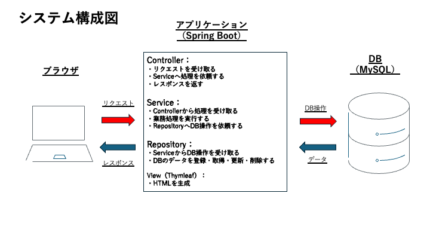
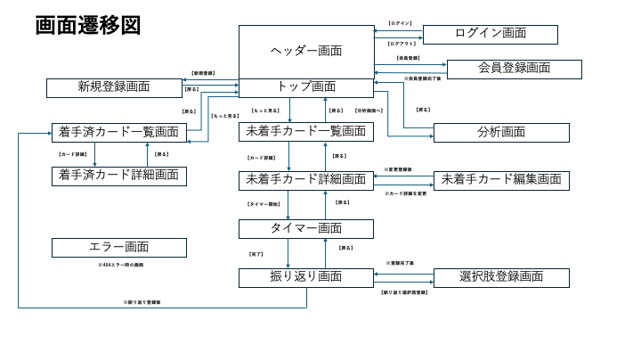
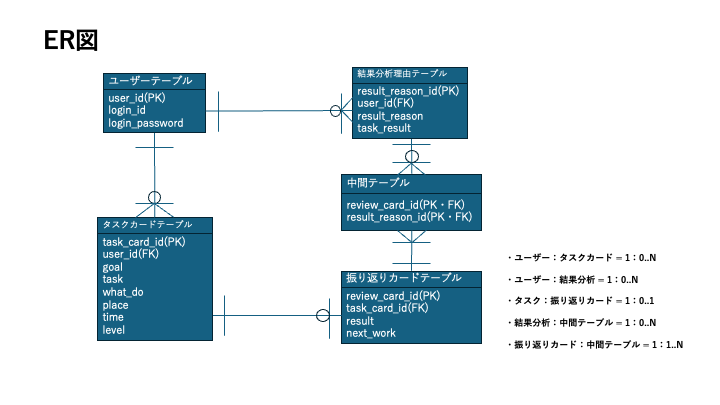

# タイマー × 振り返りWebアプリ

## 1. アプリ概要

学習タスクの管理・時間計測・振り返りを一連の流れで行う学習支援Webアプリです。
タイマー終了後に達成・未達成とその理由、次回の改善策を記録することで、学習結果を振り返り、次の行動改善につなげることを目的としています。

## 2. 開発背景・目的

学習をしていくにあたって、以下の悩みがありました。

- タスクの管理
- 学習目標を立てても、目標を達成できない
- 目標達成できない原因を分析しようにも、振り返りが苦手

そこで、自身の悩みを解決するため、

- タスク
- 時間
- 振り返り

これらの管理に特化した学習支援アプリを作成することにしました。

## 3. 主な機能

- タスク管理機能：
目標、取り組むタスク、実施時間、完了基準などを設定し、タスクを登録・管理できます

- タイマー機能： 
タスクごとに設定した時間でタイマーを実行し、終了後に振り返りへ移行します

- 振り返り機能：
タスク終了後に「達成/未達成」を記録し、その理由を複数選択した上で、次回に活かす行動を記録します

- 分析機能：
蓄積した振り返り結果から、月毎の進捗や「達成した理由」「未達成だった理由」の傾向を確認できます

## 4. 使用技術

## 4. 使用技術

| 分類 | 技術 |
| --- | --- |
| バックエンド | Java / Spring Boot |
| フロントエンド | HTML / CSS / Thymeleaf |
| データベース | MySQL |
| バージョン管理 | Git / GitHub |
| 開発環境 | Eclipse / VS Code |

## 5. システム構成

Spring Bootを中心としたWebアプリケーションとして構成しています。

[システム構成図（PDF）](docs/external-design/system-architecture.pdf)

## 6. 画面・機能イメージ

タスク登録からタイマー、振り返りまでを一連の流れとして設計しています。

詳細な画面設計については以下を参照してください。

- [画面一覧](docs/external-design/screen-list.pdf)
- [ワイヤーフレーム](docs/external-design/wireframes.pdf)

## 7. DB設計

ユーザー・タスク・振り返り結果を管理できるようにテーブルを設計しました。

また、1つの振り返りに複数の結果分析理由を登録できるよう、中間テーブルを用い多対多の関係を設計しています。

- [ER図（PDF）](docs/external-design/er-diagram.pdf)
- [テーブル定義](docs/external-design/table-definition.pdf)

## 8. 設計成果物
## 8. 設計成果物

| 成果物 | 内容 |
|---|---|
| [システム構成図](docs/external-design/system-architecture.pdf) | システム全体の構成 |
| [画面一覧](docs/external-design/screen-list.pdf) | 使用する画面と役割 |
| [画面遷移図](docs/external-design/screen-transition.pdf) | 画面間の遷移 |
| [ワイヤーフレーム](docs/external-design/wireframes.pdf) | 各画面のレイアウト |
| [ER図](docs/external-design/er-diagram.pdf) | テーブル間の関係 |
| [テーブル定義](docs/external-design/table-definition.pdf) | カラム・制約等の定義 |

## 9. 開発で意識したこと

今回の開発では、疑問点や理解が曖昧な箇所をそのままにせず、実際に手を動かしながら理解することを意識しました。

本開発ではWebアプリケーションの完成だけでなく、要件定義から設計・実装までの開発工程そのものを理解することも目的としています。

そのため、AIに成果物を自動生成してもらうのではなく、基本的には自分で考えて作成することを意識しました。

また、初めて要件定義から設計までを進めたため、成果物の作り方や設計の考え方など、分からないことも多くありました。
その際は、ChatGPT、Qiita、研修テキストなどを使って調べ、自分なりに考える → 作成する → 確認する → 修正するという流れで進めました。

例えば要件定義では、必要な機能を単に列挙するのではなく、**「この機能によってユーザーのどの課題を解決するのか」**までを言語化することに苦戦しました。
そこで、アプリを利用する場面やユーザーの行動を一つずつ整理しながら、必要な機能とその目的を考えました。

またDB設計では、外部キーや中間テーブル、制約など理解が曖昧だった部分について、設計だけで終わらせず、実際にMySQLでテーブルを作成してデータを登録しました。
意図的に制約違反となるデータも入力し、エラーを確認することで、設計した内容がどのように機能するのかを理解しました。

今後も、成果物の作成方法などの基礎知識は調べつつ、自分で調べながら開発を進めていきたいです。

## 10. 現在の開発状況

現在、要件定義および外部設計まで進めています。

- [x] 要件定義
- [x] システム構成図
- [x] 画面一覧
- [x] 画面遷移図
- [x] ワイヤーフレーム
- [x] ER図
- [x] テーブル設計
- [x] MySQLでのテーブル・制約確認
- [ ] 詳細設計
- [ ] 実装
- [ ] テスト
- [ ] デプロイ

## 11. 今後の予定

外部設計を完成させた後、詳細設計・実装・テストの順に進める予定です。

今後は以下の流れで開発を進めます。

1. **詳細設計**
   - Spring Bootのクラス構成・処理フローを設計

2. **実装**
   - 認証
   - タスク管理
   - タイマー
   - 振り返り
   - 結果分析

3. **テスト**
   - 正常系
   - 入力エラー
   - 不正操作等の異常系

4. **公開**
   - Web上へデプロイし、第三者が操作できる状態にする

